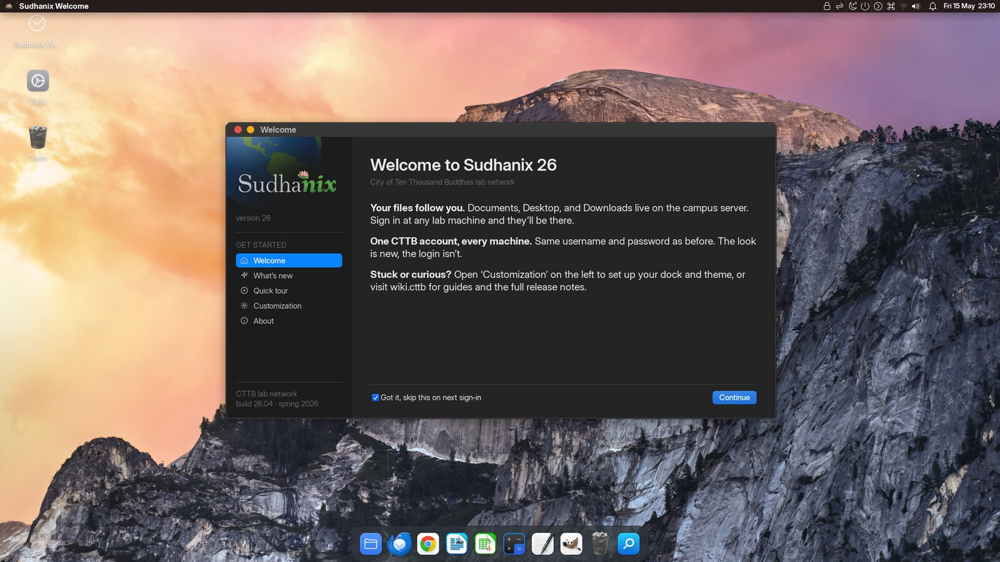

# Sudhanix Core Role

Configures XFCE4 desktop workstations for CTTB campus labs (DVGS, DVBS, DRBU).



*The Sudhanix 26 desktop this role produces, WhiteSur-Dark with the Plank dock and the first-login Welcome panel over the rotating campus wallpaper. Captured on a freshly imaged host through a real LDAP login.*

## Desktop Environment

- **Window manager**: xfwm4 (WhiteSur-Dark theme, compositing, centered placement, window snapping)
- **Panel**: xfce4-panel (top bar, autohide, global menu, lotus icon, clock, systray)
- **Dock**: Plank (macOS-style, pre-installed from Ubuntu)
- **File manager**: Thunar (list view default)
- **Terminal**: xfce4-terminal (SeriousShanns Nerd Font Mono 10pt, Man Page theme)
- **Icons**: WhiteSur-dark (light glyphs for dark backgrounds)
- **Cursors**: WhiteSur-cursors
- **Fonts**: Inter Display Semi-Bold 11 (UI), Inter Display Bold 12 (titlebars)

## Task Files

| File | Purpose |
|------|---------|
| `tasks/setup/default.yml` | Orchestrator — includes all subtask files |
| `tasks/lubuntu.yml` | Package installation (apt) |
| `tasks/lookandfeel.yml` | Themes, fonts, lightdm, panel, menu entries, xfconf configs |
| `tasks/ux.yml` | Keyboard shortcuts, Thunar defaults, devilspie2 window rules |
| `tasks/sound.yml` | ALSA driver config, PulseAudio, sound theme |
| `tasks/wallpaper.yml` | xfdesktop wallpaper rotation from storehouse archive |
| `tasks/sw.yml` | Software (office, dev tools, zoom) |
| `tasks/sw-browser.yml` | Chrome, Firefox, Zen Browser (Flatpak) |
| `tasks/sw-thunderbird.yml` | Thunderbird from Mozilla tarball + campus proxy config |
| `tasks/app-menu.yml` | Hide/show menu entries |

## Key Variables

| Variable | Default | Purpose |
|----------|---------|---------|
| `desktop_theme` | WhiteSur-Dark | xfwm4 + GTK window theme |
| `icon_theme` | WhiteSur-dark | Icon theme (light glyphs for dark mode) |
| `desktop_font` | Inter Display Semi-Bold 11 | System font |
| `desktop_session` | xfce | LightDM session type |
| `zen_browser` | true | Install Zen Browser via Flatpak |
| `chrome` | true | Install Google Chrome |
| `desktop_wallpaper_dir` | /usr/share/backgrounds/cttb | Wallpaper rotation directory |
| `desktop_wallpaper_interval_minutes` | 360 | Wallpaper rotation interval |
| `desktop_login_background` | (pic_bg) | LightDM greeter background |

## Keyboard Shortcuts

| Shortcut | Action |
|----------|--------|
| Super (tap) | Open applications menu |
| Super+Space | Application finder (Spotlight-style search) |
| Super+Left/Right | Tile window left/right |
| Super+Up | Maximize window |
| Super+Down | Tile window down |

## Applications Menu Layout

```
{hostname}
──────────
Terminal
Files
Web Browser
──────────
{all apps by category}
──────────
Log Out
Sleep
Shut Down
```

## Asset Dependencies

All assets fetched from `ansible_assets_url` (storehouse.cttb):

- `InterDisplay.tar.gz` — Inter Display font family
- `SeriousShannsNerdFontMono.tar.gz` — Terminal font
- `WhiteSur-gtk-theme.tar.gz` — GTK theme
- `WhiteSur-icon-theme.tar.gz` — Icon theme (includes dark variant)
- `WhiteSur-cursors.tar.gz` — Cursor theme
- `cttb-wallpapers.tar.gz` — Desktop wallpaper collection
- `thunderbird-latest.tar.xz` — Mozilla Thunderbird

## Customization

Per-institution settings via `group_vars/`:
- `pic_avatar` — LightDM avatar image
- `pic_bg` — Login background
- `global_proxy` — HTTP proxy config (applied to Thunderbird, system env)
- `ldap_groups` — LDAP groups for access control
- `cups_srv` — Print server hostname
